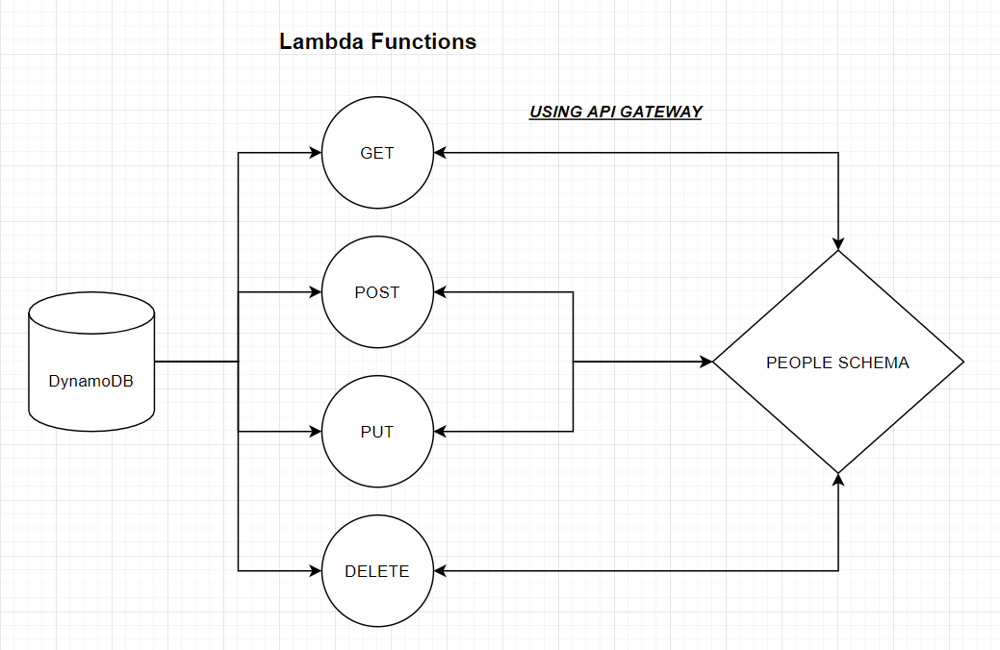

# serverless-api

**Root URL**: https://b8uqpi2z3d.execute-api.us-east-1.amazonaws.com

## Routes

- **GET**: https://b8uqpi2z3d.execute-api.us-east-1.amazonaws.com/people
- **GET WITH ID**: https://b8uqpi2z3d.execute-api.us-east-1.amazonaws.com/people/{id}
- **POST**: https://b8uqpi2z3d.execute-api.us-east-1.amazonaws.com/people
- **PUT**: https://b8uqpi2z3d.execute-api.us-east-1.amazonaws.com/people/{id}
- **DELETE**: https://b8uqpi2z3d.execute-api.us-east-1.amazonaws.com/people/{id}

## Input Requirements

- **GET**: nothing
- **GET WITH ID**: id
- **POST**: new object in event.body
- **PUT**: id and new object
- **DELETE**: id

## Output

- **GET**: array of all data in DB
- **GET WITH ID**: object with id matching the input id
- **POST**: the new object created
- **PUT**: the new object that got updated
- **DELETE**: empty object

## UML

